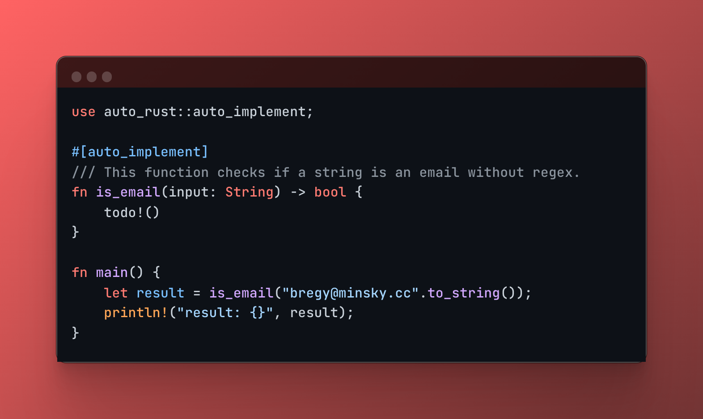

# Auto Rust

`auto-rust` is an experimental project that automatically generate Rust code with LLM (Large Language Models) during compilation, utilizing procedural macros.

<p align="center">
  
</p>

## ⚠️ Warning

Please note that Auto-Rust is currently under development and is not yet suitable for production use. While you are welcome to try it out and provide feedback, we caution that it may have an incomplete implementation and may not function as intended.

## Installation

```toml
[dependencies]
auto-rust = "0.1.0"
```

You need to create a .env file in the root of your project with the following content:

```bash
OPENAI_API_KEY=<your-openai-api-key>
```

## Example

```rust
use auto_rust::auto_implement;

#[auto_implement]
#[doc = "This function calculates if the input is a valid email address without use regex."]
fn is_email(input: String) -> bool {
    todo!()
}

fn main() {
    let result = is_email("bregyminsky.cc".to_string());
    println!("result: {}", result);
}
```

## Limitations

- LLMs are non-deterministic. If you don't get what you want from the first attempt - iterate, experiment with it.
- Actually, the context is limited by whatever code is in your function definition, no knowledge of project structure or other files.
- The extension doesn't add imports when new dependencies are introduced in the created code.

## Contributing

Contributions are welcome. Feel free to open an issue if you have any questions or want to suggest an improvement.
